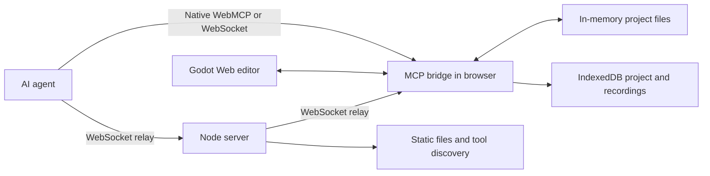

# FLow

FLow is a browser-hosted Godot editor that an AI agent can control through WebMCP.

It uses the experimental Godot Web editor. The editor, project files, and tool bridge run in one browser page. You do not need a local Godot installation. The agent can create a project, edit it, run it, inspect it, and save artifacts from that page.

## Purpose

Godot is powerful, but its editor has a large learning surface. FLow gives an agent direct, controlled access to that editor. This lets a people turn game ideas into working Godot projects without the steep learning curve of learning game engine fundamentals. 

FLow also supports repeatable work for experienced Godot users. An agent can create starter files, change scene data, run playtests, capture results, and do other routine tasks.

## What runs where

The Godot editor runs as WebAssembly in the browser. `public/mcp_bridge.js` runs in the same page. It owns the active project state and provides the tools.

The Node server serves the page and can relay MCP messages between an external agent and an open editor page. It does not run Godot or own project state.




The agent can connect in two ways:

- **Native WebMCP:** The agent calls tools that the open page registers through `document.modelContext` or `navigator.modelContext`.
- **WebSocket relay:** An external agent sends a JSON-RPC request to `/mcp`. The server forwards it to a connected editor page and returns the page response.

Tool execution always occurs in the page. The HTTP endpoints only provide health data and tool discovery.

## Main capabilities

FLow can:

- Create a Godot project from a built-in template or a file set.
- Read project files and inspect a parsed scene graph.
- Apply revision-checked file transactions and text patches.
- Update eligible GDScript files without replacing the editor.
- Add, transform, recolor, and delete supported 3D nodes through Godot editor commands.
- Run and stop the project, send input, capture the viewport, and record playtests.
- Export the active project as a ZIP file.
- Save project state and recordings in browser IndexedDB.
- Report session state, tool operations, logs, diagnostics, and game telemetry.

The tool names use the `godot_` prefix. The complete tool catalog is available at `/api/mcp/tools` when the server is running.

## Project change paths

FLow uses two change paths. Select the path that matches the work.


| Path                | Use it for                                                                                  | Effect                                                     |
| ------------------- | ------------------------------------------------------------------------------------------- | ---------------------------------------------------------- |
| Transaction         | Project setup, assets, multi-file changes, and changes that need a file-level undo snapshot | Writes project files and replaces the editor when required |
| Live editor command | Supported 3D scene edits, selection, property reads, and camera guidance                    | Uses Godot editor commands and does not replace the editor |


Eligible GDScript-only writes use a separate hot-script path. The bridge writes the script into the running editor, waits for Godot to reload it, and restores the previous script if compilation fails.

Each mutating request can include an idempotency key. A retry with the same key returns the first result instead of applying the change again.

## State and persistence

The active project first lives in page memory. FLow persists project snapshots, recordings, and uploads in IndexedDB.

Each scene change has a revision number. File transactions require the expected revision. This prevents one agent action from silently overwriting a newer change.

Mutation results report separate facts:

- `applied` states how the editor received the change.
- `source_synced` states whether the written scene source matches the requested change.
- `source_authoritative` states whether Godot supplied the observed source data.
- `persisted` states whether the snapshot reached IndexedDB.

Do not treat `source_synced: null` as a successful check. It means FLow could not verify the result.

## Run locally

Requirements:

- Node.js 20 or later
- A modern browser with WebAssembly and SharedArrayBuffer support

```bash
cd godot-web-mcp
npm install
node server.mjs
```

Open `http://localhost:8060`.

The server provides:


| Address          | Purpose                                     |
| ---------------- | ------------------------------------------- |
| `/`              | Godot Web editor                            |
| `/mcp`           | WebSocket relay for agents and editor pages |
| `/api/health`    | Server and connection status                |
| `/api/mcp/tools` | Read-only tool catalog                      |
| `/api/mcp/rpc`   | JSON-RPC `tools/list` only                  |


The server sets Cross-Origin Opener Policy and Cross-Origin Embedder Policy headers. The Godot Web build needs these headers for SharedArrayBuffer and threading support.

## Current limitations

This project uses an experimental Godot Web editor, which means that there are a number of limitations present in the current project. 

- The active editor state belongs to one open browser tab. It is not shared across tabs or browsers.
- A hidden or background browser tab can throttle the Godot main loop. Keep the editor visible while it starts, stops, runs a playtest, or replaces the editor.
- Some changes require an editor replacement. If an editor exit hangs, recovery currently requires a page reload.
- The live mutator supports 3D scene work only. It is not a general 2D editing system.
- There is no general asset pipeline.
- `godot_connect_signal_live`, `godot_resize_gizmo_live`, `godot_live_code_diff`, `godot_hot_reload_property`, and `godot_switch_mode` are deliberate stubs. They report that they are unsupported. They do not claim success.
- Netlify, Vercel, and the Node server use manually synchronized configuration and tool catalog data.

