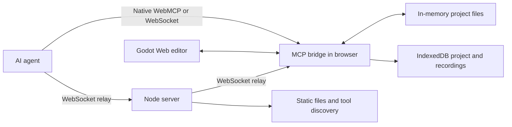

# FLow

FLow is a browser-hosted Godot editor that an AI agent can control through WebMCP.

It uses the experimental Godot Web editor. The editor, project files, and tool bridge run in one browser page. You do not need a local Godot installation. The agent can create a project, edit it, run it, inspect it, and save artifacts from that page.

## Purpose

Godot is powerful, but its editor has a large learning surface. FLow gives an agent direct, controlled access to that editor. This lets a people turn game ideas into working Godot projects without the steep learning curve of learning game engine fundamentals. 

FLow also supports repeatable work for experienced Godot users. An agent can create starter files, change scene data, run playtests, capture results, and do other routine tasks.

## What runs where

The Godot editor runs as WebAssembly in the browser. `public/mcp_bridge.js` runs in the same page. It owns the active project state and provides the tools.

The Node server serves the page and can relay MCP messages between an external agent and an open editor page. It does not run Godot or own project state.




The agent can connect in two ways:

- **Native WebMCP:** The agent calls tools that the open page registers through `document.modelContext` or `navigator.modelContext`.
- **WebSocket relay:** An external agent sends a JSON-RPC request to `/mcp`. The server forwards it to a connected editor page and returns the page response.

Tool execution always occurs in the page. The HTTP endpoints only provide health data and tool discovery.

## Main capabilities

FLow can:

- Create a Godot project from a built-in template or a file set.
- Read project files and inspect a parsed scene graph.
- Apply revision-checked file transactions and text patches.
- Update eligible GDScript files without replacing the editor.
- Add, transform, recolor, and delete supported 3D nodes through Godot editor commands.
- Set node properties and connect signals on the live scene, through Godot's own undo stack.
- Add physics bodies with collision shapes, in 2D or 3D: static level geometry, simulated
  rigid bodies, character bodies, and trigger volumes.
- Import images, fonts, and glTF models into the running editor, and place an imported model
  in the scene as an instanced node.
- Synthesize a procedural sound suite and load it in the running game.
- Run and stop the project, send input, capture the viewport, and record playtests.
- Read what the person has selected in the editor, so a request like "make this taller" can be
  resolved against the real selection.
- Export the active project as a ZIP file.
- Save project state and recordings in browser IndexedDB.
- Report session state, tool operations, logs, diagnostics, and game telemetry.

The tool names use the `godot_` prefix. The complete tool catalog is available at `/api/mcp/tools` when the server is running.

## Project change paths

FLow uses two change paths. Select the path that matches the work.


| Path                | Use it for                                                                                  | Effect                                                     |
| ------------------- | ------------------------------------------------------------------------------------------- | ---------------------------------------------------------- |
| Transaction         | Project setup, assets, multi-file changes, and changes that need a file-level undo snapshot | Writes project files, and replaces the editor only when the write cannot be applied live |
| Live editor command | Supported 3D scene edits, selection, property reads, and camera guidance                    | Uses Godot editor commands and does not replace the editor |

A transaction applies live when every file in it can be. Scripts are compiled and
hash-acknowledged; scenes, resources and shaders are scanned and then loaded, so a mistyped
`SubResource` is caught rather than published; data files need only the scan. These still
replace the editor: `project.godot`, anything under `addons/`, a delete, binary content, and a
scene the editor currently has open — reloading that one would discard the live tree and the
undo history without asking.


Eligible GDScript-only writes use a separate hot-script path. The bridge writes the script into the running editor, waits for Godot to reload it, and restores the previous script if compilation fails.

Each mutating request can include an idempotency key. A retry with the same key returns the first result instead of applying the change again.

## Assets

Binary assets enter a project through `godot_import_asset`. The bytes are written into the
running editor, Godot scans and imports them, and the tool reports what Godot confirmed rather
than assuming the write succeeded. An imported asset is a real project file: it survives an
editor replacement and it is included in the exported ZIP.

`godot_node_body` adds a floor, a wall, a solid prop or a trigger volume: a physics body, its
collision shape and a matching mesh, created in one undo action. `godot_node_spawn` makes
visual geometry only — nothing stands on it and nothing collides with it.

Place an imported model in a scene with `godot_node_instance`. It accepts a `.glb`, a `.gltf`,
or a `.tscn` already in the project, and the placed node moves, rotates, and scales like any
other node. `godot_node_spawn` builds Godot's own primitive meshes and cannot place a model.

Audio is an ordinary asset. `godot_synthesize_audio_suite` writes a procedural suite as `.wav`
files with an `sfx_library.gd` convenience wrapper; `load()` returns an `AudioStreamWAV` and the
samples can be assigned to an `AudioStreamPlayer` in the Inspector like any other resource.

## A worked example

This is the sequence that builds a small pickup game, and roughly what each step costs on a
warm page. Every one of these calls is a tool an agent can make.

| Step                                                                      | Tool                          | Time    |
| ------------------------------------------------------------------------- | ----------------------------- | ------- |
| Create the project from a template (3D, or `arcade_2d` for a side-on 2D scene) | `godot_create_project`   | ~3 s    |
| Import a glTF model                                                       | `godot_import_asset`          | ~1 s    |
| Add the procedural sound suite                                            | `godot_synthesize_audio_suite`| ~1 s    |
| Write an arena floor scene with collision                                 | `godot_apply_file_transaction`| ~4 s    |
| Place the floor and five copies of the model                              | `godot_node_instance`         | 5-16 ms |
| Write the game loop                                                       | `godot_apply_script_patch`    | ~1 s    |
| Frame a pickup in the editor viewport                                     | `godot_camera_focus`          | ~150 ms |
| Run it and drive the player                                               | `godot_run_game`, `godot_send_input` | - |
| Export it                                                                  | `godot_export_zip`            | ~1 s    |

Steps that replace the editor take seconds; live scene edits take milliseconds. The split is
the same one described under Project change paths.

For playtesting, have the project emit its own state. `godot_get_game_telemetry` reads
`godot-game-telemetry` events the project dispatches; it never substitutes simulated state. A
project that reports the player's position lets an agent steer toward a target and check the
result, instead of guessing at timings.

## Tool catalog

57 tools, all prefixed `godot_`. None of them is a stub: every tool either does the thing or says why it could not. The live catalog with full schemas is at `/api/mcp/tools`.

| Group | Tools |
| ----- | ----- |
| Session and diagnostics | `get_session_status`, `diagnose_session`, `get_logs`, `get_operation_status`, `get_user_focus` |
| Projects | `create_project`, `list_saved_projects`, `open_saved_project`, `restore_project_session`, `adopt_open_project`, `author_3d_runner`, `export_zip` |
| Project uploads | `begin_project_upload`, `upload_project_file_chunk`, `upload_project_chunk_batch`, `get_project_upload_status`, `commit_project_upload`, `abort_project_upload` |
| Files and scenes | `inspect_project_files`, `inspect_scene_graph`, `apply_file_transaction`, `apply_script_patch`, `apply_text_patch`, `undo_transaction`, `open_scene` |
| Assets and audio | `import_asset`, `synthesize_audio_suite`, `generate_audio_fx` |
| Live 2D editing | `node_spawn_2d`, `node_body_2d` (`node_transform` handles both dimensions) |
| Live 3D editing | `node_spawn`, `node_body`, `node_instance`, `node_transform`, `node_material`, `node_set_property`, `node_delete`, `select_node_live`, `transform_node_live`, `inspect_property_live`, `connect_signal_live` |
| Camera and navigation | `camera_focus`, `camera_follow`, `workspace_follow`, `switch_mode` |
| Running the game | `run_game`, `stop_game`, `send_input`, `send_input_sequence`, `get_input_sequence_status`, `send_pointer`, `get_game_telemetry`, `semantic_playtest_step` |
| Capture | `capture_viewport`, `start_recording`, `stop_recording`, `list_recordings` |

## State and persistence

The active project first lives in page memory. FLow persists project snapshots, recordings, and uploads in IndexedDB.

Each scene change has a revision number. File transactions require the expected revision. This prevents one agent action from silently overwriting a newer change.

Mutation results report separate facts:

- `applied` states how the editor received the change.
- `source_synced` states whether the written scene source matches the requested change.
- `source_authoritative` states whether Godot supplied the observed source data.
- `persisted` states whether the snapshot reached IndexedDB.

Do not treat `source_synced: null` as a successful check. It means FLow could not verify the result.

## Run locally

Requirements:

- Node.js 20 or later
- A modern browser with WebAssembly and SharedArrayBuffer support

```bash
cd godot-web-mcp
npm install
node server.mjs
```

Open `http://localhost:8060`.

The server provides:


| Address          | Purpose                                     |
| ---------------- | ------------------------------------------- |
| `/`              | Godot Web editor                            |
| `/mcp`           | WebSocket relay for agents and editor pages |
| `/api/health`    | Server and connection status                |
| `/api/mcp/tools` | Read-only tool catalog                      |
| `/api/mcp/rpc`   | JSON-RPC `tools/list` only                  |


The server sets Cross-Origin Opener Policy and Cross-Origin Embedder Policy headers. The Godot
Web build needs these headers for SharedArrayBuffer and threading support.

All three deployment targets serve one policy, `deploy/policy.mjs`: the Node server applies it
directly, and `node scripts/generate_deploy_config.mjs` writes `netlify.toml` and `vercel.json`
from it. Edit the policy, not the generated files.

## Tests

```bash
npm test
```

The suite is pure over the bridge's logic and runs without a browser. It checks tool-catalog
parity between the in-page manifest and the HTTP catalog, the operation state machine, scene
projection maths, the hot-script channel, the editor lifecycle and playtest handshake, and
that the editor plugin dispatches every op the bridge calls.

## Godot Web editor limitations

FLow is built on the experimental Godot Web editor. These are constraints of that build, not
design choices. Each one is measured, and the tool that meets it reports the constraint rather
than reporting success.

- **Keyboard shortcuts cannot be delivered to the editor.** A browser sends no keyboard input
  to a document that does not have focus; `emit_signal("gui_input")` never reaches Godot's own
  handling, because `Control._gui_input` is a virtual the engine calls rather than a signal
  handler; and `Viewport.push_input` routes keys by GUI focus. Mouse events have none of these
  problems, so anything an agent drives in the viewport is driven with the mouse.
- **There is no scripted route to the editor camera.** Godot exposes the 3D viewport but no
  method to move its camera. `godot_camera_focus` therefore pans and dollies the viewport and
  measures the resulting pose, rather than setting it.
- **A hidden or throttled tab pauses the engine.** Godot's main loop runs on
  `requestAnimationFrame`, so a backgrounded tab stops making progress. Long operations spend a
  foreground-active budget rather than wall-clock time, and say how much of the wait was spent
  hidden.
- **One tab owns the editor.** The active editor state is not shared across tabs or browsers.
- **A scene the editor has open cannot be written live.** Reloading it from disk would discard
  the live editor tree and the undo history with no prompt, so that write replaces the editor
  instead. So do `project.godot`, `addons/`, deletes and binary content. If an editor exit
  hangs, recovery needs a page reload; the project is safe in storage.
- **A live 2D edit is not written into the scene file.** The bridge serializes 3D scene text,
  not 2D, so `godot_node_spawn_2d`, `godot_node_body_2d` and a 2D `godot_node_transform` report
  `source_synced: false` and `persisted: false`: the node is real in the editor and absent from
  the `.tscn` until the scene is saved or written through a transaction.
- **A property set live in the editor is not written into the scene file.**
  `godot_node_set_property` changes the node in the running editor and reports `persisted:
  false`; a transaction or a scene save is what makes it durable.
- **Runtime property injection is not offered.** The playtest runs in a second engine with its
  own filesystem, and there is no honest channel into it. A project that wants to be steered
  while running should emit and accept its own telemetry, as the worked example does.
- **The tool catalog is duplicated** between the in-page manifest and the HTTP catalog.
  `npm test` fails if the two drift.

## Where this is going

Named here so the gaps above read as a roadmap rather than a list of dead ends.

- Asset import driven from a URL or a drag-and-drop, not only from base64 supplied by an agent.

## License

ISC. See `LICENSE`.
